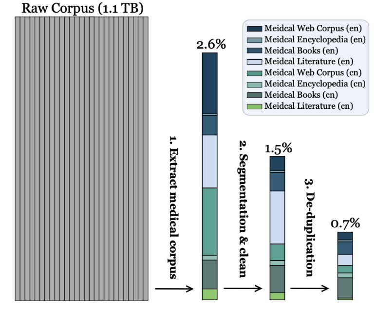

# HuatuoGPT2, One-stage Training for Medical Adaption of LLMs

## ✨ Latest News
- [11/24/2023] We released the **quantitative version** of HuatuoGPT-II.
- [11/21/2023] We released HuatuoGPT-II models. The HuatuoGPT-II will be available in **7B**, **13B**, and **34B** versions.
- [11/17/2023] We released the [HuatuoGPT-II paper](https://arxiv.org/abs/2311.09774), achieving a new **state-of-the-art** in Chinese medical applications! Try our [demo](https://www.notion.so/HuatuoGPT-Exploring-the-Reliability-of-Medical-LLMs-c14ad27cc1c74991b37df32c1d5ac375?pvs=21)!


## ⚡ Introduction

Hello! Welcome to the repository for [HuatuoGPT2](https://arxiv.org/abs/2311.09774). 

HuatuoGPT2 employs an innovative domain adaptation method to significantly boost its medical knowledge and dialogue proficiency. It showcases state-of-the-art performance in several medical benchmarks, especially surpassing GPT-4 in expert evaluations and the fresh medical licensing exams.

The open-source release of HuatuoGPT-2 includes:

- **HuatuoGPT2 Model**: Open-sourcing of 7B, 13B, and 34B versions.
- **Training Code**: Training code for one-stage adaptation will be provided, enabling better model adaptation across various languages and domains.
- **HuatuoGPT2 Data**: Release of partial pre-training and fine-tuning instructions.
- **Domain Data Pipeline**: A system for extracting high-quality domain-specific data from general corpora.
- **Evaluation for Chinese Medical LLM**: Comprehensive automatic evaluation methods for medical response capabilities of LLM and the fresh professional pharmacist exam assessment.

<div align=center>

</div>


## 🌟 Performance

Compared with representative open-source models and closed-source models (including GPT-4), HuatuoGPT2 showed impressive performance on medical benchmarks. Here, we present two of the results.

- **Expert Evaluation**: In assessments by medical professionals, HuatuoGPT-II's responses in Chinese medical contexts were favored over counterparts like GPT-4: 

| **HuatuoGPT-II Win Rate**              | **Win** | **Tie** | **Fail** |
| -------------------------------------- | ------- | ------- | -------- |
| **Single-round Medical Response**      |         |         |          |
| HuatuoGPT-II(7B) vs GPT-4              | **38**  | 38      | 24       |
| HuatuoGPT-II(7B) vs ChatGPT            | **52**  | 33      | 15       |
| HuatuoGPT-II(7B) vs Baichuan2-13B-Chat | **63**  | 19      | 18       |
| HuatuoGPT-II(7B) vs HuatuoGPT          | **81**  | 11      | 8        |
| **Multi-round Medical Dialogue**       |         |         |          |
| HuatuoGPT-II(7B) vs GPT-4              | **53**  | 17      | 30       |
| HuatuoGPT-II(7B) vs ChatGPT            | **56**  | 11      | 33       |
| HuatuoGPT-II(7B) vs Baichuan2-13B-Chat | **63**  | 19      | 18       |
| HuatuoGPT-II(7B) vs HuatuoGPT          | **68**  | 6       | 26       |

- **The Fresh Medical Exams**: We collected the fresh 2023 Chinese National Pharmacist Licensure Examination, which started on October 21, 2023. This date is later than our data finalization. HuatuoGPT2 achieved the best results in this exam, as shown below.

<div align=center>

</div>


## 👩‍⚕️ Model

### Model Access

Our model is now available on Huggingface. You can Try our model in https://www.huatuogpt.cn/.

| Model          | Hackbone           | Checkpoint    |
| -------------- | ------------------ | ------------- |
| HuatuoGPT2-7B  | Baichuan2-7B-Base  | [HF Lnik](https://huggingface.co/FreedomIntelligence/HuatuoGPT2-7B) |
| HuatuoGPT2-13B | Baichuan2-13B-Base | [HF Lnik](https://huggingface.co/FreedomIntelligence/HuatuoGPT2-13B) |
| HuatuoGPT2-34B | Yi-34B             | [HF Lnik](https://huggingface.co/FreedomIntelligence/HuatuoGPT2-34B) |

### Quantization Model

A quantized version of HuatuoGPT2 is also provided, allowing users with constrained memory or computing resources to access our HuatuoGPT2.
| Quantization          | Hackbone      | Checkpoint |
| --------------------- | ------------- | ------------- |
| HuatuoGPT2-7B (Int4)  | Baichuan2-7B-Base | HF Lnik |
| HuatuoGPT2-7B (Int8) | Baichuan2-7B-Base | HF Lnik |
| HuatuoGPT2-34B (Int4)       | Yi-34B        | HF Lnik |
| HuatuoGPT2-34B (Int8)        | Yi-34B        | HF Lnik |

### Model Inference

```bash
import torch
from transformers import AutoModelForCausalLM, AutoTokenizer
tokenizer = AutoTokenizer.from_pretrained("FreedomIntelligence/HuatuoGPT2-7B", use_fast=True, trust_remote_code=True)
model = AutoModelForCausalLM.from_pretrained("FreedomIntelligence/HuatuoGPT2-7B", device_map="auto", torch_dtype=torch.bfloat16, trust_remote_code=True)
messages = []
messages.append({"role": "user", "content": "肚子疼怎么办？"})
response = model.HuatuoChat(tokenizer, messages)
print(response)
```

#### Inference with Command Line

```bash
python cli_demo.py
```


## ⚒️ One-stage Adapation

### Data Unification

<div align=center>

</div>
- HuatuoGPT2 transforms the pre-training corpus into  (instruction, output) pairs using LLM. Utilize the script for Data Unification.

```Bash
python adapation/data_unification/unify_via_chatgpt.py
```

### One-stage training
<div align=center>

</div>
- We introduce a priority sampling approach, pre-processing data with this algorithm:

```bash
python adapation/one_stage_training/data_preprocess.py
```

- Then, training is conducted using one-stage training:

```Bash
python adapation/one_stage_training/one_stage_training.py
```

By adopting the One-stage Adaptation method, you will observe the following loss curve:

<div align=center>

</div>


## 🔍 Data Pipline

<div align=center>

</div>

The domain data pipeline is used to extract high-quality medical data from massive amounts of general corpora. It mainly consists of four steps.

### 1. Extract medical corpus

```bash
Python data_pipline/1_extraction.py
```

### 2. Segmentation

```bash
Python data_pipline/2_segmentation.py
```

### 3. cleaning

```bash
Python data_pipline/3_cleaning.py
```

### 4. De-deplication

```bash
Python data_pipline/4_de_deplication.py
```


## 🧐 Evaluation

Here, we will provide our evaluation data and scripts.

### Automated Evaluation of Medical Response Quality

- Single-turn response evaluation using GPT-4:

```bash
python evaluation/GPT4_eval_inst.py
```

- Multi-turn dialogue evaluation using GPT-4:

```bash
python evaluation/GPT4_eval_conv.py
```

### The Fresh Medical Exams

Access our newest medical exam dataset via the link provided. The dataset includes complete exam questions, with exam dates noted to alert for potential leaks. We plan to release more updated exams in the future.

| Examination                                                  | #Question | Exam Time  | Links       |
| ------------------------------------------------------------ | --------- | ---------- | ----------- |
| 2023 Chinese National Pharmacist Licensure Examination (Pharmacy) | 480       | 2023.10.21 | huggingface |
| 2023 Chinese National Pharmacist Licensure Examination (TCM) | 480       | 2023.10.22 | huggingface |
| Other **Fresh** Medical Examination is in coming             |           |            |             |


## 🩺 HuatuoGPT Series 

The HuatuoGPT series has so far launched two generations:

- **HuatuoGPT**: A Doctor-like Medical Large Language Model
- **HuatuoGPT-II**:  An Domain-enhanced Medical Large Language Model

In the future, we will continue to release new versions of HuatuoGPT. Our goal is to enhance the capabilities of LLM in the Chinese medical field and to adhere to open-source principles (aligned with the ethos of FreedomIntelligence). We hope to work together with everyone to promote the development of medical LLM!


## Citation
```
@misc{chen2023huatuogptii,
      title={HuatuoGPT-II, One-stage Training for Medical Adaption of LLMs}, 
      author={Junying Chen and Xidong Wang and Anningzhe Gao and Feng Jiang and Shunian Chen and Hongbo Zhang and Dingjie Song and Wenya Xie and Chuyi Kong and Jianquan Li and Xiang Wan and Haizhou Li and Benyou Wang},
      year={2023},
      eprint={2311.09774},
      archivePrefix={arXiv},
      primaryClass={cs.CL}
}

@article{huatuogpt-2023,
  title={HuatuoGPT, Towards Taming Language Models To Be a Doctor},
  author={Hongbo Zhang and Junying Chen and Feng Jiang and Fei Yu and Zhihong Chen and Jianquan Li and Guiming Chen and Xiangbo Wu and Zhiyi Zhang and Qingying Xiao and Xiang Wan and Benyou Wang and Haizhou Li},
  journal={arXiv preprint arXiv:2305.15075},
  year={2023}
}
```
We are from the School of Data Science, the Chinese University of Hong Kong, Shenzhen (CUHKSZ) and the Shenzhen Rsearch Institute of Big Data (SRIBD).


